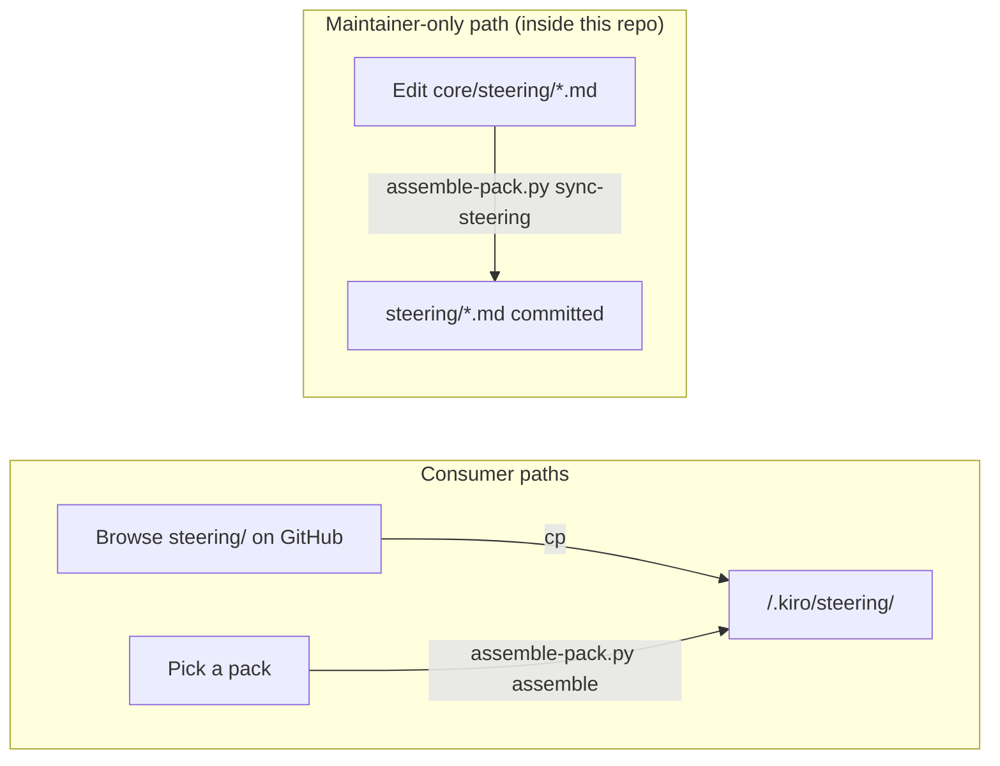

# Design Document

## Overview

This Repo is a small, copy-first library of AI-assisted development standards for Kiro users on AWS-heavy projects. It is content, not an application: Markdown plus a handful of YAML manifests and one small Python script.

The design uses a **hybrid two-layer content model**:

- **`core/` — maintainer-facing source layer.** The reusable source of truth, organized by subject (`core/steering/`, `core/platforms/`, `core/application/`, `core/languages/`). Consumers are not required to read or understand `core/` to use the Repo.
- **`steering/` — user-facing ready-to-copy catalog.** Kiro-ready files a consumer copies directly into their project's `.kiro/steering/`.

Kiro's foundational triad (`product.md`, `tech.md`, `structure.md`) lives under `tools/kiro/foundational/` as Kiro-specific templates a consumer copies and customizes. Packs (`packs/<name>/manifest.yaml`) are lightweight YAML manifests naming a coherent set of foundational files and reusable files for a stack; a single Python script assembles a pack into a target project.

### Consumer and maintainer paths



Two consumer paths, one maintainer path:
- **(A) Browse-and-copy.** Browse `steering/` on GitHub, copy individual files into `.kiro/steering/`.
- **(B) Pack assemble.** Pick a pack, run `scripts/assemble-pack.py assemble --pack <name> --target <dir>`, get a populated `.kiro/steering/`.
- **(M) Maintainer sync.** Inside this repo only, `assemble-pack.py sync-steering` regenerates `steering/<topic>.md` from `core/steering/<topic>.md` so the committed consumer catalog cannot drift from its source.

The assembly script is a small convenience tool. It is not the primary conceptual product — copy-first is.

## Directory structure

```
reusable-ai-dev-standards-library/
├── README.md
├── docs/
│   └── philosophy.md
├── core/
│   ├── steering/{security,repo-standards,cicd,api-standards}.md
│   ├── platforms/aws.md
│   ├── application/{aws-serverless,frontend-web,microservices}.md
│   └── languages/{python,typescript}.md
├── steering/
│   ├── security.md
│   ├── repo-standards.md
│   ├── cicd.md
│   └── api-standards.md
├── specs/
│   └── templates/{requirements,design,tasks}.md
├── tools/
│   └── kiro/
│       └── foundational/{product,tech,structure}.md
├── packs/
│   ├── aws-serverless-api-python/manifest.yaml
│   ├── aws-event-driven-workflow/manifest.yaml
│   └── frontend-web-typescript/manifest.yaml
└── scripts/
    └── assemble-pack.py
```

Outside the tree: this repo's own `.kiro/steering/` directory holds **Repo_Local_Steering** (`product.md`, `tech.md`, `structure.md`) that steers AI-assisted development of this Repo. It is never referenced by any pack manifest and is never read by the assembly script.

### Why v1 `steering/` is only the four cross-cutting topics

In v1, `steering/` contains exactly the four user-facing topics listed in R2 (`security.md`, `repo-standards.md`, `cicd.md`, `api-standards.md`). It does not include platform/application/language files. The standalone catalog is for **cross-cutting topics every project benefits from**; stack-specific files (AWS, serverless, Python, TypeScript, etc.) are delivered to consumers via **packs**, not via the browse catalog. Keeping `steering/` small also keeps the browse experience honest: nothing in it is stack-specific noise.

## Responsibilities

Each area has exactly one job.

- **`README.md`** — single landing page. Describes the copy-first workflow, links to `steering/`, lists the three packs, shows the one-line `assemble-pack.py` command. Enough for a new contributor to consume the repo without reading internal architecture (R17.6).
- **`docs/`** — human-facing docs about this Repo. `docs/philosophy.md` explains the hybrid two-layer model and the one-file-one-job rule. Not required reading to use the Repo.
- **`core/`** — maintainer-facing source content, organized by subject. Tool-neutral Markdown for `core/steering/`; Kiro-ready Markdown (with minimal inline front-matter) for `core/platforms/`, `core/application/`, `core/languages/`. Not required reading for consumers.
- **`steering/`** — user-facing ready-to-copy Kiro catalog for cross-cutting topics. Every file is Kiro-ready and can be copied directly into a consumer's `.kiro/steering/`. Generated from `core/steering/` by the maintainer-only `sync-steering` step.
- **`specs/templates/`** — small skeleton documents for requirements, design, and tasks specs. Not referenced by any pack. Not part of the steering UX.
- **`tools/kiro/foundational/`** — Kiro-specific foundational templates: `product.md`, `tech.md`, `structure.md`. Authored directly as Kiro-ready templates for consumers to copy and customize.
- **`packs/`** — one directory per stack, each containing exactly one `manifest.yaml`. A manifest names foundational files and reusable files that belong together for a stack. No overrides, no dependencies, no version pinning, no copied content.
- **`scripts/assemble-pack.py`** — a single Python script. Assembles a pack into `<target>/.kiro/steering/`, validates all manifests, syncs `steering/` from `core/steering/`, and scans for sensitive data. Stdlib + `pyyaml` only.
- **`.kiro/steering/` (repo-local)** — steers AI-assisted development of **this Repo** only. Never referenced by a pack. Never read by the script. Never included in `steering/` or `tools/kiro/foundational/`.

**Single-job rule:** every Markdown file and every manifest has exactly one top-level subject. When a file grows two subjects, split it before adding more content to either (R9).

## Three concepts: source, consumer, foundational

1. **Source content (`core/`)** — maintainer-only reading. Organized by subject, portable where practical.
2. **Consumer catalog (`steering/`)** — user-facing, Kiro-ready, ready-to-copy files for cross-cutting topics.
3. **Kiro foundational templates (`tools/kiro/foundational/`)** — Kiro-specific `product.md` / `tech.md` / `structure.md` templates a consumer copies and customizes to describe their own project.

**Packs** are lightweight manifests that name a combination of foundational files and reusable files (from `steering/` and/or `core/`) for a stack. Packs do not contain copied content; they name paths.

## File shape

File shape varies by location and is chosen so authoring stays simple and consumers get something Kiro-ready at the seams.

| Location | Kiro front-matter | Rationale |
| --- | --- | --- |
| `core/steering/*.md` | **No** (tool-neutral) | Generated into `steering/` by the maintainer; staying tool-neutral preserves R15's "tool-neutral where practical" for the files most likely to be reused by future non-Kiro consumers. |
| `core/platforms/*.md`, `core/application/*.md`, `core/languages/*.md` | **Yes, inline** (minimal) | These are consumed only via packs (never through the browse catalog), so authoring them Kiro-ready inline keeps the assemble step a pure byte-for-byte copy with no extra sync machinery. |
| `steering/*.md` | **Yes** (generated) | User-facing; must be Kiro-ready. Generated from `core/steering/` by `sync-steering`. |
| `tools/kiro/foundational/*.md` | **Yes, authored directly** | These are Kiro-specific templates by definition. |

### Why this split

`core/steering/*.md` covers topics (security, CI/CD, API standards, repo standards) that are the most likely future reuse surface for non-Kiro tools, so keeping their source tool-neutral pays off. Stack-specific files under `core/platforms/`, `core/application/`, and `core/languages/` are only ever consumed through Kiro packs in v1, so authoring them Kiro-ready inline avoids introducing sync machinery for files nobody needs to browse.

### Example: `core/steering/security.md` → `steering/security.md`

`core/steering/security.md` (source, tool-neutral):

```markdown
# Security standards

Treat secrets as first-class. Never commit AWS account IDs, real ARNs, or personal
domains. Use `YOUR_ACCOUNT_ID`, `example.com`, and `REPLACE_ME` as Placeholders.
...
```

`steering/security.md` (generated, Kiro-ready):

```markdown
---
inclusion: always
---

# Security standards

Treat secrets as first-class. Never commit AWS account IDs, real ARNs, or personal
domains. Use `YOUR_ACCOUNT_ID`, `example.com`, and `REPLACE_ME` as Placeholders.
...
```

Byte-identical bodies; a small front-matter block is prepended by `sync-steering`.

## Source-to-consumer sync (`sync-steering`)

**Rule.** For each `core/steering/<topic>.md`, the expected content of `steering/<topic>.md` is:

1. The Kiro front-matter block for that topic from the script's `STEERING_FRONT_MATTER` map (default `inclusion: always`).
2. A blank line.
3. The byte-for-byte contents of `core/steering/<topic>.md`.

The map lives at the top of `scripts/assemble-pack.py` and is keyed by the `core/<subpath>/<subject>.md` relative path:

```python
STEERING_FRONT_MATTER: dict[str, str] = {
    "core/steering/security.md":        "---\ninclusion: always\n---\n",
    "core/steering/repo-standards.md":  "---\ninclusion: always\n---\n",
    "core/steering/cicd.md":            "---\ninclusion: always\n---\n",
    "core/steering/api-standards.md":   "---\ninclusion: always\n---\n",
}
```

Files not in the map fall through to the default (`inclusion: always`).

**Why this approach.** It keeps tooling to one script, makes drift impossible by construction, keeps `steering/` committed so GitHub browsers don't need Python, and keeps `core/steering/*.md` tool-neutral source. The maintainer runs `sync-steering` after editing any `core/steering/*.md` file; CI runs `sync-steering --check` to catch drift.

**Maintainer-only.** Consumers never run `sync-steering`. They see `steering/` already in its final form in the repo.

## Pack manifest design

### Minimal schema

A Pack_Manifest declares exactly five fields:

- `name` — must equal the pack directory name.
- `version` — the pack's own semantic version.
- `description` — a short human-readable summary.
- `foundational` — list of repo-relative paths, typically under `tools/kiro/foundational/`.
- `files` — list of repo-relative paths to reusable files the assembly step will copy.

### Why the field name is `files`

The field is named **`files`** because it names file paths, not a conceptual layer. A pack's reusable entries legitimately draw from more than one place in v1:

- `steering/*.md` for cross-cutting topics (Kiro-ready, generated from `core/steering/` by `sync-steering`).
- `core/platforms/*.md`, `core/application/*.md`, `core/languages/*.md` for stack-specific files (Kiro-ready, authored inline).
- `tools/kiro/foundational/*.md` for the product/tech/structure triad (listed in `foundational`, same mechanism).

Naming the field after the `core/` directory would force an awkward choice: either pack-delivered cross-cutting topics arrive tool-neutral (missing Kiro front-matter) and consumers have to add it by hand, or `core/steering/*.md` has to carry Kiro front-matter, which defeats R15's intent to keep `core/` tool-neutral where practical. Neither is acceptable.

The separation between the source layer (`core/`) and the consumer layer (`steering/`) is enforced by **directory purpose**, not by manifest field name:
- `core/` is maintainer-facing source.
- `steering/` is the user-facing consumer catalog.
- `tools/kiro/foundational/` is Kiro-specific templates.

`files` is neutral and accurate across all three. The schema stays minimal (`name`, `version`, `description`, `foundational`, `files`) and honest about what it describes.

### Paths are the contract

The assembly step always does the same thing: byte-for-byte copy. Whether a `files` entry points under `steering/`, `core/`, or `tools/kiro/foundational/`, the step is identical.

In v1, packs point at `steering/*.md` for cross-cutting topics so assemble is a plain copy of an already-Kiro-ready file. For stack-specific files (`core/platforms/`, `core/application/`, `core/languages/`), manifests point at the `core/...` paths directly and those files are authored Kiro-ready inline (see File shape above). This keeps assemble trivial and avoids generating per-pack files under `steering/`.

### No extensibility surface

Packs do **not** support overrides, dependencies, per-file version pinning, or cross-file reference syntax. The manifest lists files; the script copies them. Any of the above would add moving parts and is explicitly deferred.

### Concrete v1 manifests

```yaml
# packs/aws-serverless-api-python/manifest.yaml
name: aws-serverless-api-python
version: 0.1.0
description: Standards for AWS serverless HTTP APIs in Python.
foundational:
  - tools/kiro/foundational/product.md
  - tools/kiro/foundational/tech.md
  - tools/kiro/foundational/structure.md
files:
  - steering/security.md
  - steering/api-standards.md
  - core/platforms/aws.md
  - core/application/aws-serverless.md
  - core/languages/python.md
```

```yaml
# packs/aws-event-driven-workflow/manifest.yaml
name: aws-event-driven-workflow
version: 0.1.0
description: Standards for AWS event-driven microservices.
foundational:
  - tools/kiro/foundational/product.md
  - tools/kiro/foundational/tech.md
  - tools/kiro/foundational/structure.md
files:
  - steering/security.md
  - steering/cicd.md
  - core/platforms/aws.md
  - core/application/microservices.md
  - core/languages/python.md
```

```yaml
# packs/frontend-web-typescript/manifest.yaml
name: frontend-web-typescript
version: 0.1.0
description: Standards for frontend web projects in TypeScript.
foundational:
  - tools/kiro/foundational/product.md
  - tools/kiro/foundational/tech.md
  - tools/kiro/foundational/structure.md
files:
  - steering/security.md
  - steering/api-standards.md
  - core/application/frontend-web.md
  - core/languages/typescript.md
```

## Assembly script behavior

One file, one job: `scripts/assemble-pack.py` is a small Python script that copies files and enforces the rules above.

### CLI surface

- `python scripts/assemble-pack.py assemble --pack <pack-name> --target <dir> [--force]`
- `python scripts/assemble-pack.py validate`
- `python scripts/assemble-pack.py sync-steering [--check]` — maintainer-only
- `python scripts/assemble-pack.py scan`
- `python scripts/assemble-pack.py check-all` — runs `validate` + `sync-steering --check` + `scan`

### Mode: `assemble`

- Reads `packs/<pack-name>/manifest.yaml`.
- For each path in `foundational` and `files`, copies the file to `<target>/.kiro/steering/<basename>.md`.
- **Byte-for-byte copy.** No front-matter injection at assemble time. Files under `steering/` and `tools/kiro/foundational/` are already Kiro-ready; files under `core/platforms/`, `core/application/`, and `core/languages/` are authored Kiro-ready inline. Front-matter synthesis only happens in the separate maintainer-only `sync-steering` step.
- `<target>` must exist. `<target>/.kiro/steering/` must either not exist, be empty, or be writable with `--force` (in which case existing content is replaced; see **No partial writes** below for the exact commit mechanism).

#### No partial writes (stage-and-atomic-move)

Assemble mode is all-or-nothing from the consumer's perspective. **Either the entire new `<target>/.kiro/steering/` is in place, or the consumer's tree is untouched.** The mechanism is simple and boring:

1. **Stage.** Create a sibling staging directory at `<target>/.kiro/steering.partial-<suffix>/` where `<suffix>` is `secrets.token_hex(4)`. The staging directory is a **sibling** of the final destination so the commit-step rename is guaranteed to be on the same filesystem. Do **not** use `tempfile.TemporaryDirectory()` in the system temp dir — that may cross filesystem boundaries and break atomicity.
2. **Copy.** For each manifest entry in `foundational` and `files`, copy the file into the staging directory under its final basename (`<staging>/<basename>.md`). Only after every copy completes successfully does the script proceed to commit.
3. **Commit.** Atomically put staging into place with a single `os.replace` / `os.rename`:
   - If `<target>/.kiro/steering/` does not exist: `os.replace(staging, final)`.
   - If `<target>/.kiro/steering/` exists and is empty: `os.rmdir(final)` then `os.replace(staging, final)`.
   - If `<target>/.kiro/steering/` exists, is non-empty, and `--force` was passed, do the following in order:
     a. Rename the existing final directory to a sibling backup: `os.rename(final, <target>/.kiro/steering.backup-<suffix>)`.
     b. Atomically put staging into place: `os.replace(staging, final)`.
     c. **If step (b) raises, attempt rollback.** Run `os.rename(backup, final)` to restore the consumer's original directory to its original path. Exit non-zero with a message that names **both** the commit failure **and** the rollback outcome (success or failure). If rollback itself fails, the script MUST exit non-zero and explicitly name **both** surviving paths — the still-present backup (`<target>/.kiro/steering.backup-<suffix>`) and the empty or missing final path (`<target>/.kiro/steering/`) — so the consumer can recover manually.
     d. **If step (b) succeeds, remove the backup:** `shutil.rmtree(backup)`. If `shutil.rmtree` fails here, log a warning naming the backup path and exit `0` — the primary operation has already succeeded and the backup is only a leftover artifact the consumer can delete at leisure. This leftover-backup case is the **only** non-fatal warning case in the `--force` path.
   - If `<target>/.kiro/steering/` exists, is non-empty, and `--force` was **not** passed: fail before staging begins.
4. **Failure during staging.** Any I/O error during step 2 (disk full, permission denied, missing source file, etc.) causes the script to best-effort remove the staging directory and exit non-zero. The consumer's existing `<target>/.kiro/steering/` (if any) is untouched.
5. **Failure during commit.** The commit step is a single atomic rename per branch of step 3. For the no-existing and empty-existing branches, the rename either happens or it does not — failure leaves the consumer's tree untouched and the script exits non-zero. For the `--force` non-empty branch, a commit failure triggers the explicit rollback described in step 3(c): the consumer's original directory is either restored to its original path (normal case), or — in the rare double-fault where both commit and rollback fail — the error message names the surviving backup path so the consumer can rename it back manually.

**The guarantee, stated plainly.**
- **On a successful assemble:** `<target>/.kiro/steering/` contains exactly the manifest's resolved outputs; any pre-existing contents have been fully replaced; no staging or backup directories remain.
- **On a failed assemble** (including I/O failure during commit): `<target>/.kiro/steering/` is either still present with its original contents — because rollback succeeded, or because the commit never swapped the directory — OR, in the rare double-fault case where the commit fails AND rollback also fails, the consumer is told exactly where their original contents are (`<target>/.kiro/steering.backup-<suffix>`) and what they need to do to restore them manually. The script never silently leaves the consumer's tree in a partial or ambiguous state.

**Why stage-and-atomic-move with rollback.** It is simple, uses only stdlib (`os.rename`, `os.replace`, `shutil.rmtree`, `secrets.token_hex`), and delivers true no-partial-writes semantics. The rollback step adds a single extra `os.rename` on the commit-failure path — no bookkeeping, no journals, no new dependencies.

**Naming convention.** Staging directory: `<target>/.kiro/steering.partial-<token_hex(4)>`. Backup directory (only created when `--force` replaces a non-empty existing directory): `<target>/.kiro/steering.backup-<token_hex(4)>`.

### Mode: `validate`

Walks every `packs/*/manifest.yaml`. For each manifest, confirms:

- Valid YAML.
- `name` equals the pack directory name.
- Required fields are present: `name`, `version`, `description`, `foundational`, `files`. No unknown fields.
- Every path listed in `foundational` and `files` exists at its repo-relative path.
- No two entries (across `foundational` and `files` combined) within one pack share the same destination basename.

### Mode: `sync-steering` (maintainer-only)

- Without `--check`: for each `core/steering/<topic>.md`, computes `expected = FRONT_MATTER(topic) + "\n" + bytes(core/steering/<topic>.md)` and rewrites `steering/<topic>.md` to match.
- With `--check`: computes the expected content and exits non-zero if the on-disk `steering/<topic>.md` differs. Prints a diff summary naming each drifted file.
- The set of topics is the set of files present under `core/steering/`. Extra files under `steering/` that have no `core/steering/` counterpart are flagged with `--check` and ignored during write (to avoid deleting files the maintainer may have intentionally committed).

### Mode: `scan`

- Enumerates files via `git ls-files` (tracked files only).
- Runs the sensitive-data regex set (see Validation and sensitive-data policy) over each file.
- Exits non-zero on any match, printing `<file>:<line>: pattern <name>` per hit.

### Mode: `check-all`

Runs `validate`, then `sync-steering --check`, then `scan`. Exits non-zero on the first failure and continues to report remaining failures where practical. Intended to be the single entry point for the pre-commit hook and CI.

### Destination layout and basename collisions

Every file in `foundational` and `files` lands at `<target>/.kiro/steering/<basename>.md`. If two listed entries within a single pack share a basename, both `validate` and `assemble` fail with a message naming both source paths. In v1, no collisions occur: foundational uses `product.md` / `tech.md` / `structure.md`; the `files` entries use subject-specific names (`security.md`, `api-standards.md`, `aws.md`, `python.md`, etc.).

### Failure behavior

**Fail-fast with a pre-write plan, then commit atomically.** Before staging anything, the script:

1. Loads and validates the manifest.
2. Confirms every source path in `foundational` and `files` exists.
3. Confirms there are no basename collisions.
4. Confirms `<target>` exists and that `<target>/.kiro/steering/` is either absent, empty, or `--force` was passed.

Only then does it stage, and only after staging completes does it commit atomically with rollback on failure. **Assemble mode never leaves the consumer's `.kiro/steering/` in a partially-written state.** Either the entire new directory is in place, or the consumer's tree is untouched (or, in the rare double-fault case, the consumer is told exactly where to find their original contents).

### Exit codes and tooling

- Exit `0` on success, non-zero on any failure.
- Runtime: Python 3.12+.
- Dependencies: stdlib + `pyyaml` only. No other runtime dependencies.

## Validation and sensitive-data policy

### Manifest validation

Covered above under `validate`: YAML well-formedness, field presence, no unknown fields, `name` matches directory, every listed file exists, no basename collisions within a pack.

### Sensitive-data regex set

The regex set lives inline in `scripts/assemble-pack.py` as a small list (~20 entries). Representative patterns:

- AWS account IDs embedded in ARNs (`arn:aws:[^:]+:[^:]*:\d{12}:`) excluding the sentinel `000000000000`.
- AWS access key ID shape: `\bAKIA[0-9A-Z]{16}\b`.
- AWS secret access key shape: `\b[A-Za-z0-9/+=]{40}\b` (applied with a file-local allowlist to avoid hash collisions).
- Plausible personal email addresses outside an allowlist (e.g., not `example.com`, not `@users.noreply.github.com`).
- Bare AWS account IDs outside of the sentinel (`\b\d{12}\b` with the `000000000000` exclusion).
- GitHub handles where `YOUR_GITHUB_USERNAME` was expected (contextual patterns around `github.com/<handle>`).

On any match, `scan` exits non-zero and prints `<file>:<line>: pattern <name>`.

### Pre-commit hook

A pre-commit hook invokes `python scripts/assemble-pack.py check-all`. CI runs the same entry point.

## Repo-local steering vs user-facing content

`.kiro/steering/` in **this** Repo contains `product.md`, `tech.md`, and `structure.md` that steer AI-assisted development of this Repo itself. It is:

- Never read by `assemble-pack.py`.
- Never included in any pack manifest.
- Never surfaced as user-facing content.

Filenames intentionally overlap with `tools/kiro/foundational/` because they are the same kind of file for a different target project. The two directories serve different projects and must not be conflated.

## Spec templates

`specs/templates/{requirements,design,tasks}.md` are small skeletons used to start a new feature spec. They are free of project-specific content (using blank sections or Placeholders). The requirements template guides authors toward clear, testable requirements expressed as user stories with acceptance criteria. Spec templates are not referenced by any pack manifest in v1 (R10.4).

## Error handling

| Failure class | Caught where | Exit behavior |
| --- | --- | --- |
| YAML parse error in a manifest | `validate`, `assemble` | Non-zero; print file path and parse error |
| `name` field does not match pack directory | `validate`, `assemble` | Non-zero; print manifest path, expected vs. actual |
| Missing required field in manifest (including `files`) | `validate`, `assemble` | Non-zero; print manifest path and missing field |
| Unknown field in manifest | `validate`, `assemble` | Non-zero; print manifest path and unknown field |
| Referenced file does not exist (in `foundational` or `files`) | `validate`, `assemble` | Non-zero; print manifest path and missing file |
| Basename collision within a pack | `validate`, `assemble` | Non-zero; print both source paths and conflicting basename |
| `<target>` does not exist, or `.kiro/steering/` not empty without `--force` | `assemble` | Non-zero before any staging; print target path and reason |
| I/O error during staging | `assemble` | Staging directory removed (best effort); consumer's existing `.kiro/steering/` untouched; exit non-zero |
| I/O error during commit (`os.replace` fails, rollback succeeds) | `assemble` | Exit non-zero; consumer's existing `.kiro/steering/` restored to its original path via `os.rename(backup, final)`; no staging or backup directories remain; message names both the commit error and the successful rollback |
| I/O error during commit AND rollback fails (double fault) | `assemble` | Exit non-zero; message explicitly names the surviving backup path (`<target>/.kiro/steering.backup-<suffix>`) and instructs the consumer to rename it back manually; this is the only case where manual intervention is required; no automatic retry |
| Backup removal fails after successful `--force` replacement | `assemble` | Log warning naming the backup path; exit `0` (primary operation already succeeded). **Only non-fatal warning case in the assemble flow.** |
| Drift between `core/steering/<topic>.md` and `steering/<topic>.md` | `sync-steering --check` | Non-zero; list each drifted file |
| Sensitive-data match | `scan` | Non-zero; print `<file>:<line>: pattern <name>` per match |

`check-all` aggregates the above and exits non-zero on any failure.

## Testing strategy

Plain `pytest`. Stdlib-only assertions where possible. No property-based testing, no Hypothesis, no property frameworks.

### Unit tests (`scripts/assemble-pack.py`)

- **Manifest parsing.** Valid manifest parses correctly; missing fields (including a missing `files` field), unknown fields, and malformed YAML each produce a clear error.
- **`validate`.** Golden manifests pass. Synthetic broken manifests (missing files, wrong `name`, colliding basenames, unknown fields, `files` entry pointing at a non-existent path) fail with the expected exit code and message.
- **`assemble` — success path.** Given a tmp target, assembling each v1 pack produces the expected set of files under `<target>/.kiro/steering/` with **byte-for-byte** identical content to the sources. No `.kiro/steering.partial-*` or `.kiro/steering.backup-*` directories remain after success.
- **`assemble` — `--force` success path.** Pre-populate `<target>/.kiro/steering/` with a fixture set of files whose basenames differ from the manifest. Run `assemble --force`. Assert: the final `<target>/.kiro/steering/` contents exactly match the manifest (the fixture files are gone), and no `.kiro/steering.backup-*` directory remains.
- **`assemble` — no-`--force` rejection.** Pre-populate `<target>/.kiro/steering/` with a fixture file. Run `assemble` without `--force`. Assert: exit non-zero, fixture file still present, no staging or backup directories exist.
- **`assemble` — no partial writes on staging failure.** Pre-populate `<target>/.kiro/steering/` with a fixture set of files. Inject a staging-phase I/O failure (e.g., monkey-patch `shutil.copy` to raise partway through the manifest, or point one manifest entry at a path that exists at validate time but is removed before copy). Run `assemble --force`. Assert: exit non-zero, the fixture contents of `<target>/.kiro/steering/` are byte-for-byte unchanged, no `.kiro/steering.partial-*` directory remains, no `.kiro/steering.backup-*` directory remains.
- **`assemble` — `--force` commit failure with successful rollback.** Pre-populate `<target>/.kiro/steering/` with a fixture set of files whose basenames differ from the manifest. Monkey-patch `os.replace` (or the equivalent commit call) to raise on the staging→final step. Run `assemble --force`. Assert: exit non-zero, the fixture contents of `<target>/.kiro/steering/` are byte-for-byte unchanged (rollback restored them), no `.kiro/steering.partial-*` directory remains, no `.kiro/steering.backup-*` directory remains, and the error message names **both** the commit failure **and** the rollback success.
- **`assemble` — `--force` double-fault (commit fails AND rollback fails).** Pre-populate `<target>/.kiro/steering/` with fixtures. Arrange for both the commit step (`os.replace(staging, final)`) AND the rollback rename (`os.rename(backup, final)`) to raise. Run `assemble --force`. Assert: exit non-zero, the backup directory `<target>/.kiro/steering.backup-*` still exists and contains the original fixtures byte-for-byte, and the error message explicitly names the backup path and instructs the consumer to rename it manually.
- **`sync-steering`.** Given a `core/steering/<topic>.md` and a `STEERING_FRONT_MATTER` entry, the generated `steering/<topic>.md` is byte-for-byte equal to `front_matter + "\n" + core_bytes`.
- **`sync-steering --check`.** Exits `0` when in sync; exits non-zero and lists drifted files when any `steering/<topic>.md` differs from its expected content.
- **`scan`.** Known-bad strings (real-looking account IDs, AKIA keys, personal emails) match; placeholders (`YOUR_ACCOUNT_ID`, `000000000000`, `example.com`, `REPLACE_ME`) do not.

### Smoke tests

- For each v1 pack: `assemble --pack <name> --target <tmpdir>` exits `0` and produces the expected set of files with the expected basenames.
- `check-all` on the repo working tree exits `0`.

### What is out of scope for testing

No PBT. No Hypothesis. No schema-registry validation. No semantic diffing.

## Future extensibility

- `core/` can grow with more platforms/applications/languages without touching the script — the assemble step only copies files named in a manifest.
- `tools/` can grow with more tool-specific foundational directories (e.g., `tools/cursor/foundational/`); new packs can list those paths and the script still works.
- `steering/` can grow to cover more cross-cutting topics if needed; adding a new topic requires (a) a new `core/steering/<topic>.md` and (b) a run of `sync-steering`.
- Cross-file references, overrides, rendering pipelines, and plugin systems can be added later **if** a concrete need emerges. v1 does not need them.

## Explicitly deferred until after v1

- Rendering pipeline, cross-file reference syntax, pack overrides, pack dependencies, per-file version pinning.
- Adapters for AI dev tools other than Kiro (Cursor, Claude Code, Copilot, etc.).
- Cloud providers other than AWS.
- Languages other than Python 3.12+ and JavaScript/TypeScript.
- Heavyweight validation mechanisms (schema registries, semantic diff, content hashing).
- Binary distribution, plugin SDKs.
- Property-based testing (explicitly not required per R13.7).

## Requirements alignment

Every v1 requirement (R1–R17) is satisfied by this design with no deferred items.

| Requirement | Satisfied in |
| --- | --- |
| R1 (source under `core/`) | Directory structure, Responsibilities, File shape |
| R2 (consumer `steering/`) | Directory structure, Source-to-consumer sync |
| R3 (Kiro foundational triad) | Directory structure, Responsibilities |
| R4 (repo-local vs user-facing) | Repo-local steering vs user-facing content |
| R5 (pack manifest schema: `name`, `version`, `description`, `foundational`, `files`) | Pack manifest design |
| R6 (three v1 packs) | Pack manifest design (concrete manifests) |
| R7 (single assembly script) | Assembly script behavior |
| R8 (sensitive-data policy) | Validation and sensitive-data policy |
| R9 (one file, one subject) | Responsibilities (single-job rule) |
| R10 (spec templates) | Spec templates |
| R11 (languages & runtime) | Directory structure (Python/TypeScript only; Node.js under platforms/application) |
| R12 (v1 scope limits) | Explicitly deferred until after v1 |
| R13 (explicit out-of-scope) | Explicitly deferred until after v1 |
| R14 (low duplication) | Source-to-consumer sync (`sync-steering --check`) |
| R15 (portability) | File shape (tool-neutral `core/steering/`; inline front-matter elsewhere) |
| R16 (no AI-tool runtime dep) | Consumer paths (browse-and-copy works with `git` + `cp`) |
| R17 (v1 acceptance) | All sections above collectively |
